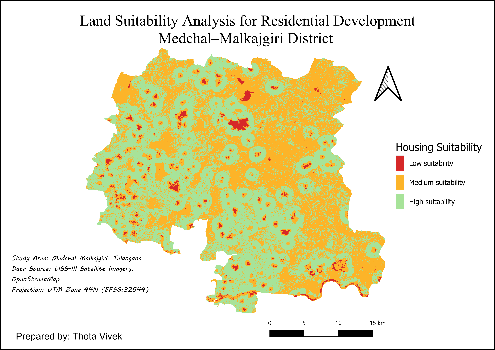

# Geospatial LULC Suitability Analysis Using Remote Sensing and Machine Learning



---

# Overview

This project integrates Remote Sensing, GIS, Spatial Analysis, and Machine Learning techniques to perform Land Use Land Cover (LULC) suitability analysis for the Medchal region.

The workflow includes satellite image preprocessing, spectral index generation, raster-based suitability modeling, proximity analysis, and machine learning-based spatial prediction.

An interactive web visualization platform was also developed for displaying suitability outputs and spatial layers.

---

# Objectives

- Perform preprocessing of multispectral satellite imagery
- Generate spectral indices such as NDVI, NDBI, NDWI, and SAVI
- Conduct LULC classification and suitability analysis
- Generate raster and proximity-based spatial factors
- Apply machine learning techniques for suitability prediction
- Visualize outputs through a web-based interface

---

# Technologies Used

## GIS & Remote Sensing

- QGIS
- GDAL
- Raster Analysis
- Vector Analysis
- Spatial Modeling

## Machine Learning

- Python
- Scikit-learn
- NumPy
- Rasterio
- GeoPandas

## Web Development

- Vite
- JavaScript
- HTML
- CSS

---

# Project Workflow

```text
Satellite Data Acquisition
        ↓
Image Preprocessing
        ↓
Georeferencing & Clipping
        ↓
NDVI / NDBI / NDWI / SAVI Generation
        ↓
LULC Classification
        ↓
Raster Factor Preparation
        ↓
Proximity Analysis
        ↓
Suitability Modeling
        ↓
Machine Learning Prediction
        ↓
Final Suitability Mapping
        ↓
Web Visualization
```

---

# Project Structure

```text
├── Phase_1_Data/
│   ├── Boundary_Data/
│   ├── Satellite_Image/
│   └── vectors/
│
├── Phase_2_Preprocessing/
│   ├── classification/
│   ├── georef/
│   ├── Raster/
│   ├── scp layer/
│   └── Vector/
│
├── Phase_3_NDVI/
│   ├── ndbi/
│   ├── ndwi/
│   ├── savi/
│   └── NDVI_Medchal.tif
│
├── Phase_4_LULC/
│   ├── Proximity/
│   ├── raster_factors/
│   ├── lulc_vector.gpkg
│   └── total_area.csv
│
├── Phase_5_ML/
│   ├── suitability/
│   ├── roads_distance.tif
│   ├── roads_raster.tif
│   ├── water_distance.tif
│   └── water_raster.tif
│
├── results/
│   ├── final_suitability_ml.tif
│   ├── final_suitability.png
│   ├── final_suit_for_ml.png
│   └── LULC_Suitability_Map.pdf
│
└── website/
    ├── src/
    ├── public/
    ├── train_random_forest_suitability.py
    └── train_multilayer_spatial_random_forest.py
```

---

# Spectral Indices Used

## NDVI — Normalized Difference Vegetation Index

Used for vegetation analysis and green cover extraction.

**NDVI = (NIR - Red) / (NIR + Red)**

---

## NDBI — Normalized Difference Built-up Index

Used for built-up land identification.

**NDBI = (SWIR - NIR) / (SWIR + NIR)**

---

## NDWI — Normalized Difference Water Index

Used for water body extraction.

**NDWI = (Green - NIR) / (Green + NIR)**

---

## SAVI — Soil Adjusted Vegetation Index

Used to minimize soil brightness effects.

**SAVI = ((NIR - Red) × (1 + L)) / (NIR + Red + L)**

---
# Machine Learning Component

The project integrates Random Forest-based spatial suitability prediction using raster factors and proximity layers.

## Scripts

- `train_random_forest_suitability.py`
- `train_multilayer_spatial_random_forest.py`

These scripts automate spatial suitability prediction and multilayer raster analysis workflows.

---

# Results

## Final Suitability Map

The final suitability outputs were generated using:

- Raster factor analysis
- Proximity analysis
- Spectral indices
- LULC classification
- Machine learning-based prediction

### Key Outputs

- `final_suitability.png`
- `final_suit_for_ml.png`
- `LULC_Suitability_Map.pdf`

---

## Full Dataset Access

Large geospatial raster and vector datasets were excluded from GitHub due to storage limitations.

Download Full Dataset:

[Google Drive Dataset Link](https://drive.google.com/drive/folders/1ocKIoZVEBqPdhSl7Kd3wevYbGbxp2HFD?usp=sharing)

The dataset includes:
- Raw satellite imagery
- GeoTIFF rasters
- GeoJSON/KML vectors
- Intermediate preprocessing outputs
- ML suitability rasters

---

# Web Visualization

A frontend web application was developed to visualize geospatial outputs and suitability maps interactively.

The website includes:

- Raster visualization
- Spatial layer rendering
- Suitability map display
- GIS-based data interaction

---

# Applications

This project can be applied in:

- Urban planning
- Land suitability analysis
- Smart city planning
- Environmental monitoring
- Resource management
- Infrastructure planning
- Geospatial decision support systems

---

# Future Improvements

- Deep Learning-based classification
- Time-series satellite analysis
- Cloud deployment
- Interactive GIS dashboards
- Real-time spatial analytics
- Multi-temporal LULC change detection

---

# Author

**Thota Vivek**

Undergraduate Student — Geospatial Technologies

---
